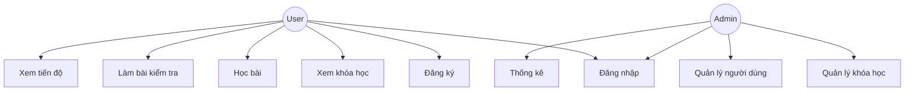
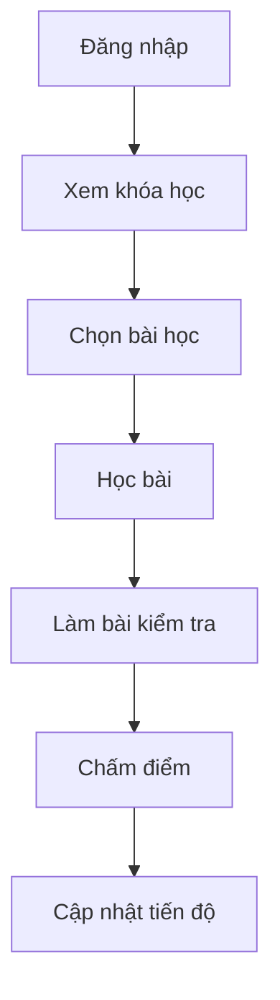
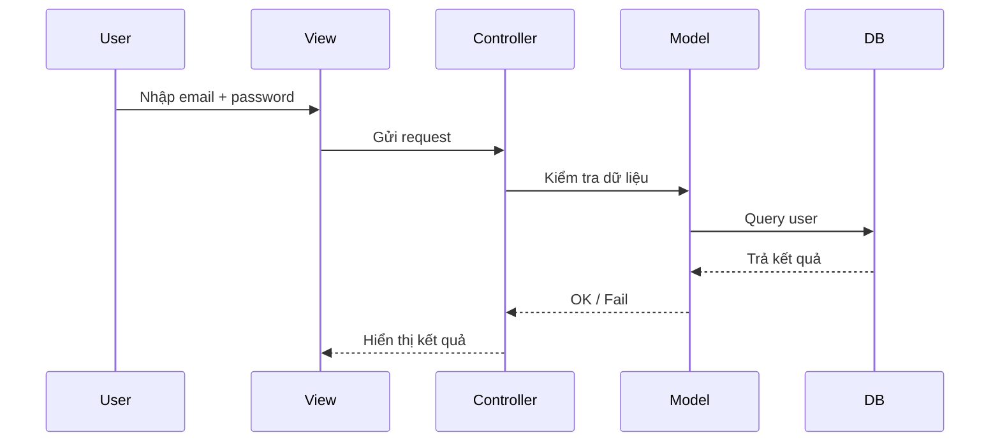
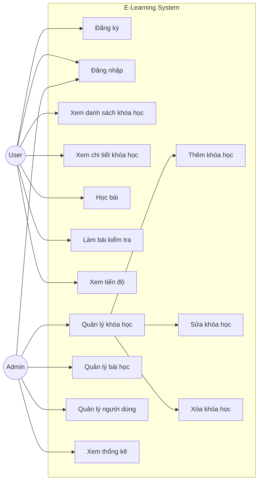
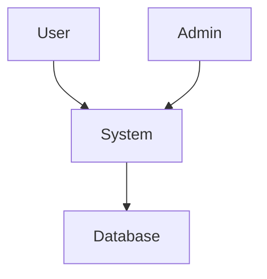
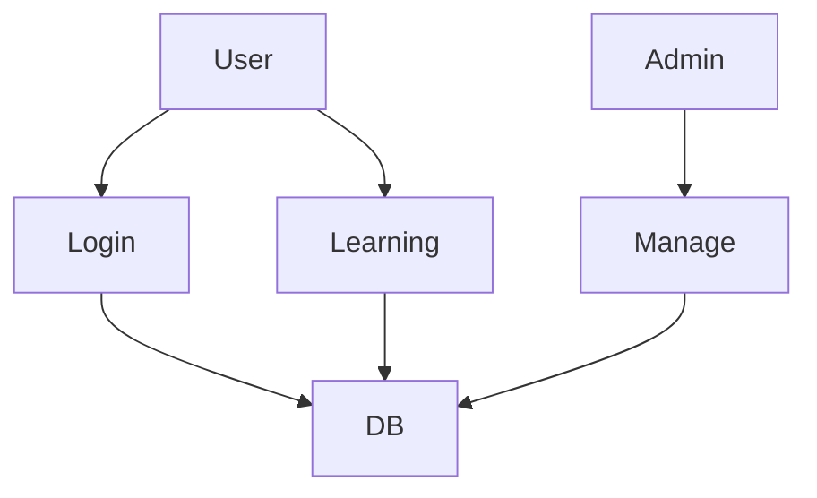
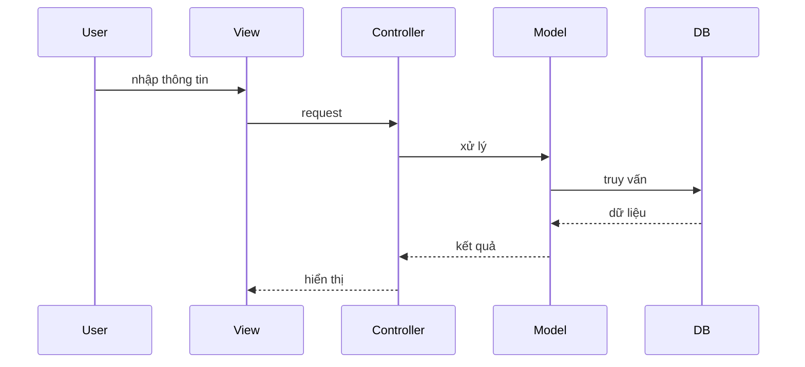
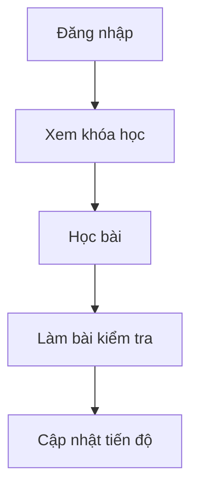
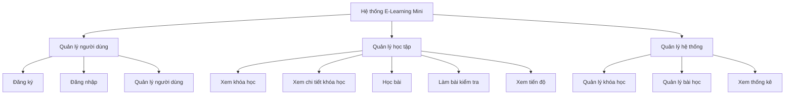

# CHƯƠNG 2: PHÂN TÍCH HỆ THỐNG – E-LEARNING MINI

## 2.1 Tổng quan

Phân tích hệ thống nhằm xác định rõ các chức năng, yêu cầu và cách thức hoạt động của hệ thống trước khi thiết kế và triển khai.

Hệ thống E-Learning Mini tập trung vào:

* Xác định actor
* Xây dựng Use Case
* Đặc tả chức năng (SRS)
* Phân tích dữ liệu và luồng xử lý

---

## 2.2 Actor (Tác nhân)

### 2.2.1 Admin

* Quản lý khóa học
* Quản lý bài học
* Quản lý người dùng
* Xem thống kê

### 2.2.2 Người dùng (User)

* Đăng ký / đăng nhập
* Xem khóa học
* Học bài
* Làm bài kiểm tra
* Xem tiến độ

---

## 2.3 Danh sách Use Case

### Admin

| Mã   | Tên                |
| ---- | ------------------ |
| UC01 | Đăng nhập          |
| UC02 | Quản lý khóa học   |
| UC03 | Quản lý bài học    |
| UC04 | Quản lý người dùng |
| UC05 | Xem thống kê       |

### User

| Mã   | Tên              |
| ---- | ---------------- |
| UC06 | Đăng ký          |
| UC07 | Đăng nhập        |
| UC08 | Xem khóa học     |
| UC09 | Học bài          |
| UC10 | Làm bài kiểm tra |
| UC11 | Xem tiến độ      |

---

## 2.4 Đặc tả Use Case (SRS rút gọn)

### UC06 – Đăng ký

* Actor: User
* Input: name, email, password
* Output: thành công / lỗi

Luồng chính:

1. Nhập thông tin
2. Kiểm tra hợp lệ
3. Lưu DB
4. Thông báo

Luồng lỗi:

* Thiếu dữ liệu
* Email sai
* Email tồn tại

---

### UC07 – Đăng nhập

* Actor: User/Admin

Luồng chính:

1. Nhập email + password
2. Kiểm tra
3. Đăng nhập thành công

Luồng lỗi:

* Sai mật khẩu
* Không tồn tại

---

### UC02 – Quản lý khóa học

* Actor: Admin

Chức năng:

* Thêm
* Sửa
* Xóa

---

### UC09 – Học bài

* Actor: User

Luồng:

1. Chọn khóa học
2. Chọn bài
3. Xem nội dung

---

### UC10 – Làm bài kiểm tra

* Actor: User

Luồng:

1. Hiển thị câu hỏi
2. Chọn đáp án
3. Nộp bài
4. Chấm điểm

---

### UC11 – Xem tiến độ

* Actor: User
* Hiển thị % hoàn thành

---

## 2.5 Yêu cầu hệ thống

### 2.5.1 Chức năng

* Đăng ký / đăng nhập
* CRUD khóa học
* Học online
* Làm quiz
* Theo dõi tiến độ

### 2.5.2 Phi chức năng

* Giao diện dễ dùng
* Tốc độ nhanh
* Bảo mật
* Ổn định

---

## 2.6 Phân tích dữ liệu

Các bảng chính:

* Users
* Courses
* Lessons
* Quizzes
* Questions
* Progress

---

## 2.7 Luồng hệ thống

### User

Đăng nhập → Xem khóa học → Học → Làm quiz → Lưu tiến độ

### Admin

Đăng nhập → Quản lý → Thống kê

---

## 2.8 Điểm nổi bật hệ thống

### 1. Chu trình học tập hoàn chỉnh

Học → Kiểm tra → Tiến độ

### 2. Theo dõi tiến độ

Hiển thị % hoàn thành

### 3. Phân quyền rõ ràng

Admin / User

### 4. Dễ mở rộng

Có thể thêm thanh toán, video, AI

---

**Kết luận:**
Chương 2 đã xác định đầy đủ chức năng, dữ liệu và luồng xử lý của hệ thống, làm cơ sở cho thiết kế ở Chương 3.

---

## 2.9 Use Case Diagram (Mermaid)

---

## 2.10 Activity Diagram (Luồng học tập)

---

## 2.11 Sequence Diagram (Đăng nhập)

# CHƯƠNG 2: PHÂN TÍCH HỆ THỐNG – E-LEARNING MINI (CHI TIẾT – CHUẨN 10 ĐIỂM)

---

## 2.1 Tổng quan

Phân tích hệ thống nhằm xác định rõ các chức năng, luồng xử lý, dữ liệu và tương tác giữa các thành phần trong hệ thống E-Learning Mini.

Mục tiêu:

* Hiểu hệ thống cần làm gì
* Xác định các chức năng
* Xây dựng sơ đồ UML
* Làm nền tảng cho thiết kế (Chương 3)

---

## 2.2 Actor (Tác nhân)

### 2.2.1 Admin

* Quản lý khóa học
* Quản lý bài học
* Quản lý người dùng
* Xem thống kê

### 2.2.2 User (Học viên)

* Đăng ký tài khoản
* Đăng nhập
* Xem khóa học
* Học bài
* Làm bài kiểm tra
* Xem tiến độ

---

## 2.3 Use Case Diagram (Sơ đồ chức năng hệ thống)

---

## 2.4 Danh sách Use Case

| Mã   | Tên                | Actor      |
| ---- | ------------------ | ---------- |
| UC01 | Đăng ký            | User       |
| UC02 | Đăng nhập          | User/Admin |
| UC03 | Xem khóa học       | User       |
| UC04 | Học bài            | User       |
| UC05 | Làm bài kiểm tra   | User       |
| UC06 | Xem tiến độ        | User       |
| UC07 | Quản lý khóa học   | Admin      |
| UC08 | Quản lý bài học    | Admin      |
| UC09 | Quản lý người dùng | Admin      |
| UC10 | Xem thống kê       | Admin      |

---

## 2.5 Đặc tả Use Case (SRS chi tiết)

### UC01 – Đăng ký

* Actor: User
* Pre-condition: Chưa có tài khoản
* Post-condition: Tạo tài khoản thành công

Main flow:

1. Người dùng nhập thông tin
2. Hệ thống kiểm tra
3. Lưu database
4. Thông báo thành công

Alternate:

* Email đã tồn tại
* Thiếu dữ liệu

---

### UC02 – Đăng nhập

* Actor: User/Admin

Main flow:

1. Nhập email và mật khẩu
2. Kiểm tra dữ liệu
3. Đăng nhập

Alternate:

* Sai thông tin

---

### UC04 – Học bài

* Actor: User

Main flow:

1. Chọn khóa học
2. Chọn bài học
3. Xem nội dung

---

### UC05 – Làm bài kiểm tra

* Actor: User

Main flow:

1. Hiển thị câu hỏi
2. Chọn đáp án
3. Nộp bài
4. Chấm điểm

---

### UC06 – Xem tiến độ

* Actor: User

Main flow:

* Hiển thị % hoàn thành

---

### UC07 – Quản lý khóa học

* Actor: Admin

Main flow:

* Thêm / sửa / xóa khóa học

---

## 2.6 Data Flow Diagram (DFD)

### Level 0

### Level 1

---

## 2.7 Sequence Diagram (Đăng nhập)

---

## 2.8 Activity Diagram (Luồng học tập)

---

## 2.9 Business Logic

* Tiến độ = (số bài đã học / tổng số bài) * 100
* Điểm = số câu đúng / tổng câu

---

## 2.10 Điểm nổi bật hệ thống

* Chu trình học tập hoàn chỉnh
* Có kiểm tra và đánh giá
* Theo dõi tiến độ
* Phân quyền rõ ràng

---

## Kết luận

Chương 2 đã mô tả đầy đủ chức năng, dữ liệu, sơ đồ UML và luồng xử lý, đảm bảo yêu cầu của một hệ thống E-Learning hoàn chỉnh.

# CHƯƠNG 2: PHÂN TÍCH HỆ THỐNG – E-LEARNING MINI (CHI TIẾT – CHUẨN 10 ĐIỂM)

---

## 2.1 Tổng quan

Phân tích hệ thống nhằm xác định rõ các chức năng, luồng xử lý, dữ liệu và tương tác giữa các thành phần trong hệ thống E-Learning Mini.

Mục tiêu:

* Hiểu hệ thống cần làm gì
* Xác định các chức năng
* Xây dựng sơ đồ UML
* Làm nền tảng cho thiết kế (Chương 3)

---

## 2.2 Actor (Tác nhân)

### 2.2.1 Admin

* Quản lý khóa học
* Quản lý bài học
* Quản lý người dùng
* Xem thống kê

### 2.2.2 User (Học viên)

* Đăng ký tài khoản
* Đăng nhập
* Xem khóa học
* Học bài
* Làm bài kiểm tra
* Xem tiến độ

---

## 2.3 Use Case Diagram (Sơ đồ chức năng hệ thống)

---

## 2.4 Danh sách Use Case

| Mã   | Tên                | Actor      |
| ---- | ------------------ | ---------- |
| UC01 | Đăng ký            | User       |
| UC02 | Đăng nhập          | User/Admin |
| UC03 | Xem khóa học       | User       |
| UC04 | Học bài            | User       |
| UC05 | Làm bài kiểm tra   | User       |
| UC06 | Xem tiến độ        | User       |
| UC07 | Quản lý khóa học   | Admin      |
| UC08 | Quản lý bài học    | Admin      |
| UC09 | Quản lý người dùng | Admin      |
| UC10 | Xem thống kê       | Admin      |

---

## 2.5 Đặc tả Use Case (SRS chi tiết)

### UC01 – Đăng ký

* Actor: User
* Pre-condition: Chưa có tài khoản
* Post-condition: Tạo tài khoản thành công

Main flow:

1. Nhập thông tin
2. Kiểm tra hợp lệ
3. Lưu database
4. Thông báo thành công

Alternate:

* Email đã tồn tại
* Thiếu dữ liệu

---

### UC02 – Đăng nhập

* Actor: User/Admin
* Pre-condition: Có tài khoản
* Post-condition: Truy cập hệ thống

Main flow:

1. Nhập email + password
2. Kiểm tra
3. Đăng nhập

Alternate:

* Sai thông tin

---

### UC03 – Xem danh sách khóa học

* Actor: User

Main flow:

1. Truy cập trang khóa học
2. Hệ thống hiển thị danh sách

---

### UC04 – Học bài

* Actor: User

Main flow:

1. Chọn khóa học
2. Chọn bài học
3. Xem nội dung

---

### UC05 – Làm bài kiểm tra

* Actor: User

Main flow:

1. Hiển thị câu hỏi
2. Chọn đáp án
3. Nộp bài
4. Hệ thống chấm điểm

---

### UC06 – Xem tiến độ

* Actor: User

Main flow:

1. Truy cập trang tiến độ
2. Hiển thị % hoàn thành

---

### UC07 – Quản lý khóa học

* Actor: Admin

Main flow:

1. Xem danh sách khóa học
2. Thêm / sửa / xóa
3. Lưu database

---

### UC08 – Quản lý bài học

* Actor: Admin

Main flow:

1. Chọn khóa học
2. Thêm / sửa / xóa bài học
3. Lưu database

---

### UC09 – Quản lý người dùng

* Actor: Admin

Main flow:

1. Xem danh sách người dùng
2. Cập nhật quyền

---

### UC10 – Xem thống kê

* Actor: Admin

Main flow:

1. Truy cập dashboard
2. Hiển thị số lượng user, khóa học, tiến độ

---

## 2.6 Data Flow Diagram (DFD)

Data Flow Diagram (DFD)

### Level 0

### Level 1

---

## 2.7 Sequence Diagram (Đăng nhập)

---

## 2.8 Activity Diagram (Luồng học tập)

---

## 2.9 Business Logic

* Tiến độ = (số bài đã học / tổng số bài) * 100
* Điểm = số câu đúng / tổng câu

---

## 2.10 Điểm nổi bật hệ thống

* Chu trình học tập hoàn chỉnh
* Có kiểm tra và đánh giá
* Theo dõi tiến độ
* Phân quyền rõ ràng

---

## 2.11 Biểu đồ phân rã chức năng (FDD)

---

## Kết luận

Chương 2 đã mô tả đầy đủ chức năng, dữ liệu, sơ đồ UML và luồng xử lý, đảm bảo yêu cầu của một hệ thống E-Learning hoàn chỉnh.

---
