---
# CHƯƠNG 2: PHÂN TÍCH HỆ THỐNG (BẢN HOÀN CHỈNH – 10 ĐIỂM)

---

## 2.1 Xác định Actor và Use Case

### Actor:

* User (Học viên)
* Admin (Quản trị viên)

---

### Danh sách Use Case

| Mã   | Tên                   | Actor       |
| ---- | --------------------- | ----------- |
| UC01 | Đăng ký               | User        |
| UC02 | Đăng nhập             | User, Admin |
| UC03 | Xem khóa học          | User        |
| UC04 | Xem chi tiết khóa học | User        |
| UC05 | Học bài               | User        |
| UC06 | Làm bài kiểm tra      | User        |
| UC07 | Xem tiến độ           | User        |
| UC08 | Quản lý khóa học      | Admin       |
| UC09 | Quản lý bài học       | Admin       |
| UC10 | Quản lý người dùng    | Admin       |
| UC11 | Xem thống kê          | Admin       |

---

## 2.2 Đặc tả Use Case (Chuẩn IEEE)

### UC02 – Đăng nhập

* Actor: User/Admin
* Mô tả: Người dùng đăng nhập hệ thống
* Pre-condition: Đã có tài khoản
* Post-condition: Truy cập hệ thống

Main flow:

1. Nhập email, password
2. Hệ thống kiểm tra
3. Thành công → chuyển trang

Alternate:

* Sai thông tin → báo lỗi

---

### UC06 – Làm bài kiểm tra

* Actor: User
* Pre-condition: Đã học bài
* Post-condition: Lưu điểm

Main flow:

1. Hiển thị câu hỏi
2. Chọn đáp án
3. Nộp bài
4. Hệ thống chấm điểm

Alternate:

* Không chọn đáp án

---

## 2.3 Use Case Diagram (Chi tiết theo chức năng)

### 2.3.1 Use Case Tổng quát

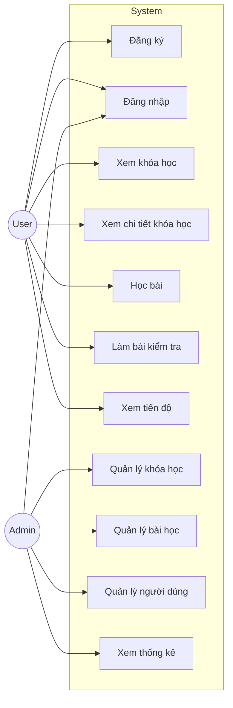

---

### 2.3.2 Use Case – Xác thực

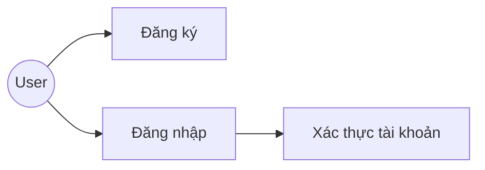

---

### 2.3.3 Use Case – Học tập

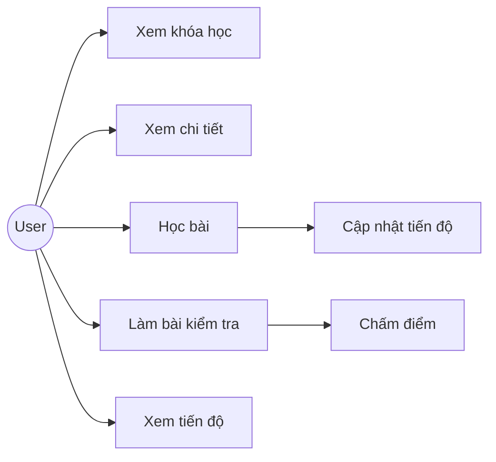

---

### 2.3.4 Use Case – Quản lý khóa học

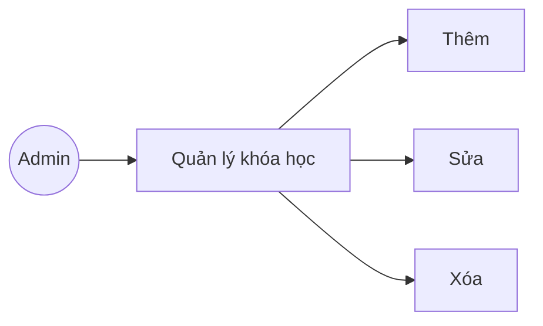

---

### 2.3.5 Use Case – Quản lý bài học

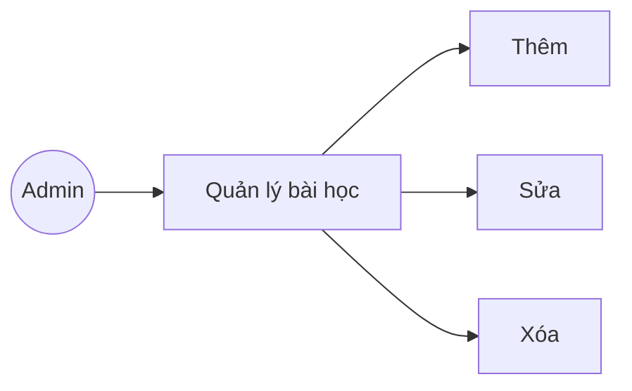

---

### 2.3.6 Use Case – Quản lý người dùng

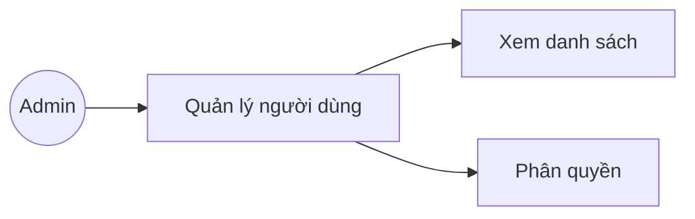

---

### 2.3.7 Use Case – Thống kê

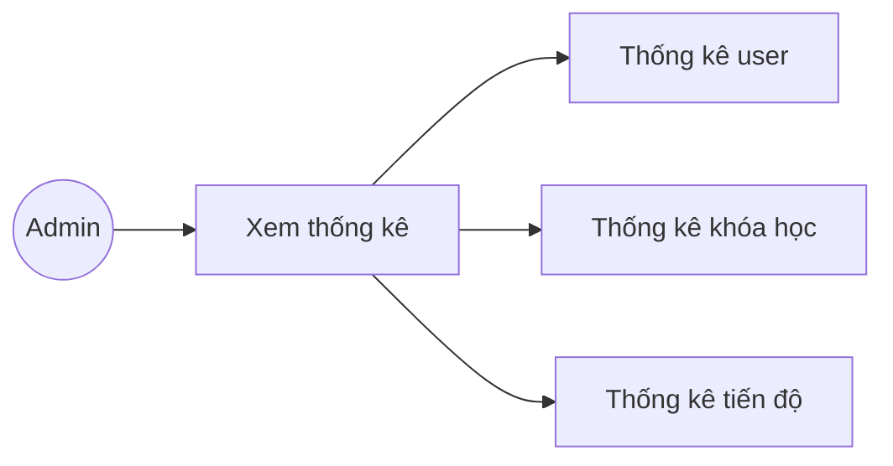

---

## 2.4 Biểu đồ phân rã chức năng (FDD)

Biểu đồ phân rã chức năng (FDD)

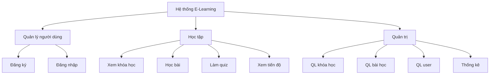

---

## 2.5 DFD Level 0

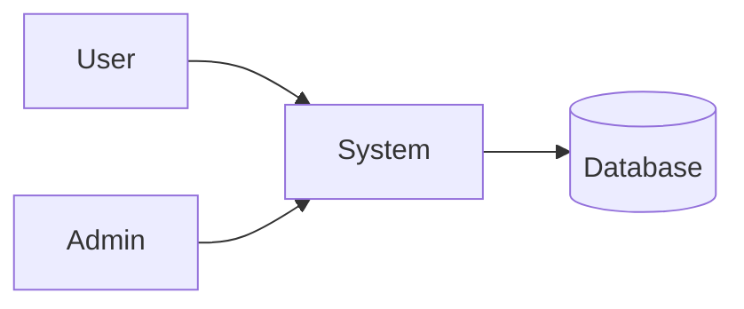

---

## 2.6 DFD Level 1 (Chi tiết)

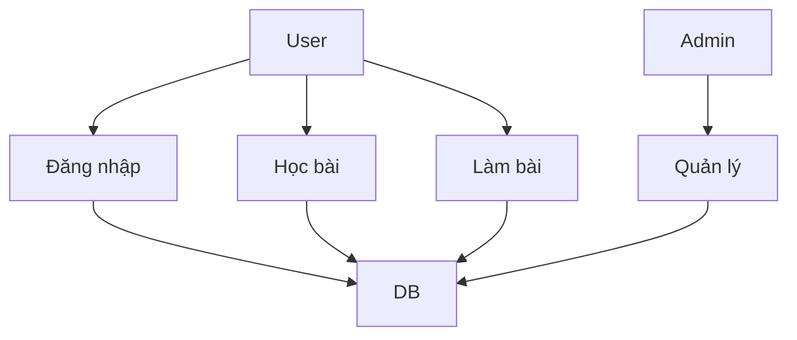

---

## 2.7 Sequence Diagram (Login)

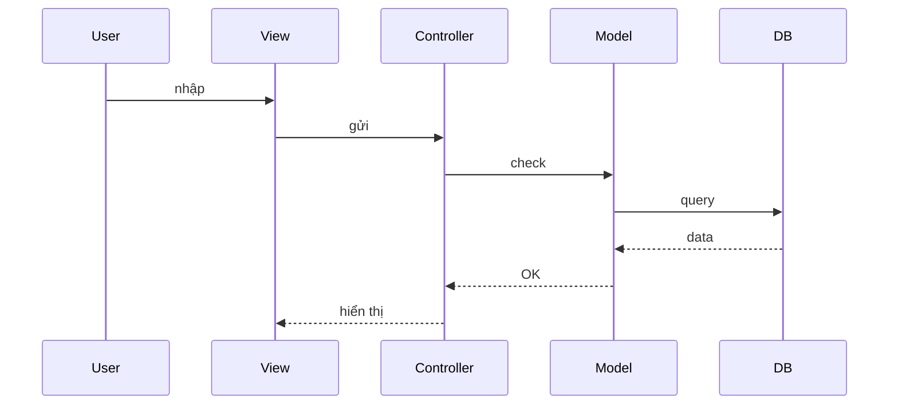

---

## 2.8 Sequence Diagram (Quiz)

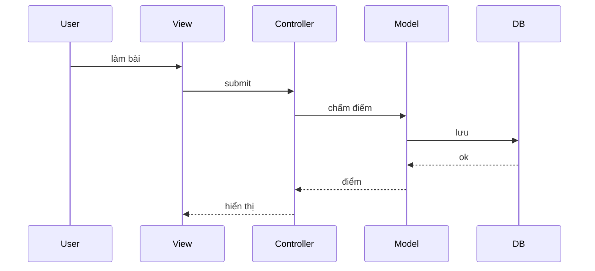

---

## 2.9 Activity Diagram

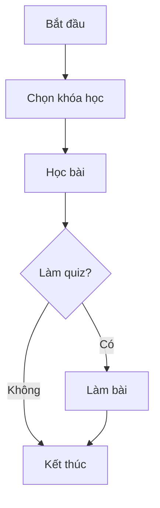

---

## 2.10 Phân tích dữ liệu

### Bảng Users

* id
* email
* password

### Bảng Courses

* id
* title

### Bảng Lessons

* id
* course_id

### Bảng Quiz

* id
* question

---

## 2.11 Business Logic

* Học bài → cập nhật tiến độ
* Làm quiz → chấm điểm tự động
* Admin quản lý dữ liệu

---

## 2.12 Điểm nổi bật

* Progress Tracking
* Auto Scoring
* MVC

---

## Kết luận chương

Chương 2 đã phân tích đầy đủ hệ thống thông qua UML, DFD và logic nghiệp vụ, làm nền cho thiết kế hệ thống.

# CHƯƠNG 2: USE CASE CHI TIẾT HỆ THỐNG E-LEARNING MINI

---

## UC01 – Đăng ký

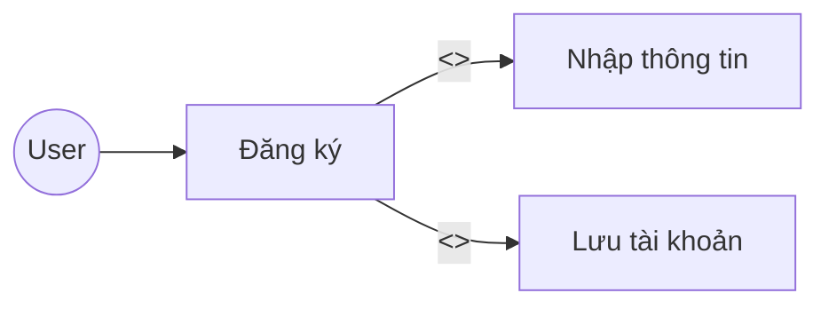

| Thành phần | Nội dung |
|----------|---------|
| Use Case | Đăng ký |
| Actor | User |
| Mục tiêu | Tạo tài khoản |
| Tiền điều kiện | Chưa có tài khoản |
| Luồng chính | Nhập thông tin → Lưu tài khoản |
| Ngoại lệ | Email tồn tại |

---

## UC02 – Đăng nhập

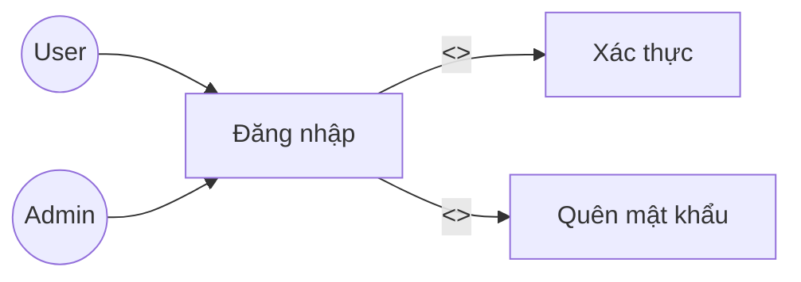

| Thành phần | Nội dung |
|----------|---------|
| Use Case | Đăng nhập |
| Actor | User, Admin |
| Mục tiêu | Truy cập hệ thống |
| Tiền điều kiện | Có tài khoản |
| Luồng chính | Nhập → Xác thực → Thành công |
| Ngoại lệ | Sai thông tin |

---

## UC03 – Xem khóa học

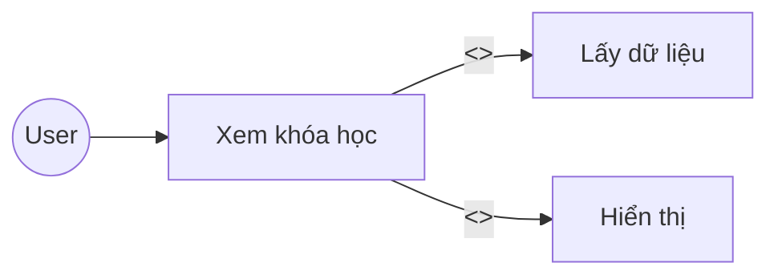

| Thành phần | Nội dung |
|----------|---------|
| Use Case | Xem khóa học |
| Actor | User |
| Mục tiêu | Xem danh sách |
| Tiền điều kiện | Đăng nhập |
| Luồng chính | Truy cập → Hiển thị |
| Ngoại lệ | Không có dữ liệu |

---

## UC04 – Xem chi tiết khóa học

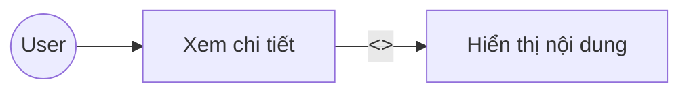

| Thành phần | Nội dung |
|----------|---------|
| Use Case | Xem chi tiết khóa học |
| Actor | User |
| Mục tiêu | Xem chi tiết |
| Tiền điều kiện | Chọn khóa học |
| Luồng chính | Hiển thị nội dung |
| Ngoại lệ | Không có dữ liệu |

---

## UC05 – Học bài

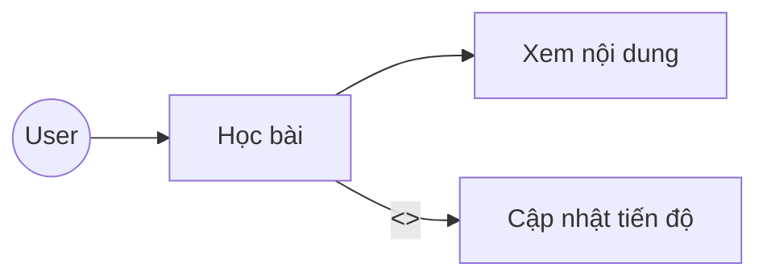

| Thành phần | Nội dung |
|----------|---------|
| Use Case | Học bài |
| Actor | User |
| Mục tiêu | Học nội dung |
| Tiền điều kiện | Chọn khóa học |
| Luồng chính | Xem bài → Cập nhật tiến độ |
| Ngoại lệ | Lỗi nội dung |

---

## UC06 – Làm bài kiểm tra

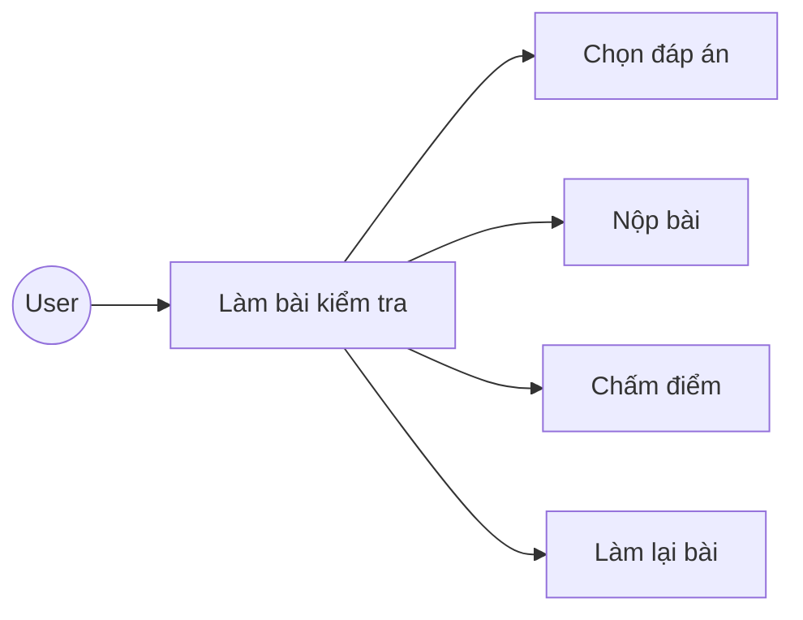

| Thành phần | Nội dung |
|----------|---------|
| Use Case | Làm bài kiểm tra |
| Actor | User |
| Mục tiêu | Đánh giá |
| Tiền điều kiện | Đã học |
| Luồng chính | Làm → Nộp → Chấm |
| Ngoại lệ | Chưa chọn đáp án |

---

## UC07 – Xem tiến độ

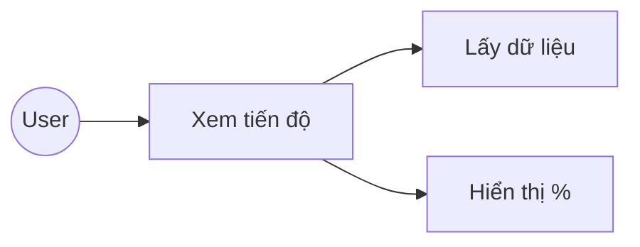

| Thành phần | Nội dung |
|----------|---------|
| Use Case | Xem tiến độ |
| Actor | User |
| Mục tiêu | Theo dõi |
| Tiền điều kiện | Đã học |
| Luồng chính | Hiển thị tiến độ |
| Ngoại lệ | Không có dữ liệu |

---

## UC08 – Quản lý khóa học

```mermaid
graph LR
Admin((Admin)) --> UC08[QL khóa học]
UC08 --> UC081[Thêm]
UC08 --> UC082[Sửa]
UC08 --> UC083[Xóa]
```

| Thành phần | Nội dung |
|----------|---------|
| Use Case | Quản lý khóa học |
| Actor | Admin |
| Mục tiêu | Quản lý dữ liệu |
| Tiền điều kiện | Đăng nhập |
| Luồng chính | Thêm/Sửa/Xóa |
| Ngoại lệ | Lỗi dữ liệu |

---

## UC09 – Quản lý bài học

```mermaid
graph LR
Admin((Admin)) --> UC09[QL bài học]
UC09 --> UC091[Thêm]
UC09 --> UC092[Sửa]
UC09 --> UC093[Xóa]
```

| Thành phần | Nội dung |
|----------|---------|
| Use Case | Quản lý bài học |
| Actor | Admin |
| Mục tiêu | Quản lý nội dung |
| Tiền điều kiện | Đăng nhập |
| Luồng chính | Thêm/Sửa/Xóa |
| Ngoại lệ | Lỗi |

---

## UC10 – Quản lý người dùng

```mermaid
graph LR
Admin((Admin)) --> UC10[QL người dùng]
UC10 --> UC101[Xem danh sách]
UC10 --> UC102[Phân quyền]
```

| Thành phần | Nội dung |
|----------|---------|
| Use Case | Quản lý người dùng |
| Actor | Admin |
| Mục tiêu | Quản lý tài khoản |
| Tiền điều kiện | Đăng nhập |
| Luồng chính | Xem → Phân quyền |
| Ngoại lệ | Lỗi hệ thống |

---

## UC11 – Xem thống kê

```mermaid
graph LR
Admin((Admin)) --> UC11[Thống kê]
UC11 --> UC111[User]
UC11 --> UC112[Khóa học]
UC11 --> UC113[Tiến độ]
```

| Thành phần | Nội dung |
|----------|---------|
| Use Case | Xem thống kê |
| Actor | Admin |
| Mục tiêu | Theo dõi hệ thống |
| Tiền điều kiện | Đăng nhập |
| Luồng chính | Hiển thị dữ liệu |
| Ngoại lệ | Không có dữ liệu |

---

# KẾT LUẬN

Mỗi Use Case đã được mô tả bằng sơ đồ riêng và bảng chi tiết, đảm bảo thể hiện đầy đủ chức năng hệ thống và mối quan hệ <<include>> và <<extend>>.
