# CHƯƠNG 2: PHÂN TÍCH HỆ THỐNG – E-LEARNING MINI (CHI TIẾT – CHUẨN 10 ĐIỂM)

---

## 2.1 Tổng quan

Phân tích hệ thống nhằm xác định rõ các chức năng, luồng xử lý, dữ liệu và tương tác giữa các thành phần trong hệ thống E-Learning Mini.

Mục tiêu:

* Hiểu hệ thống cần làm gì
* Xác định các chức năng
* Xây dựng sơ đồ UML
* Làm nền tảng cho thiết kế (Chương 3)

---

## 2.2 Actor (Tác nhân)

### 2.2.1 Admin

* Quản lý khóa học
* Quản lý bài học
* Quản lý người dùng
* Xem thống kê

### 2.2.2 User (Học viên)

* Đăng ký tài khoản
* Đăng nhập
* Xem khóa học
* Học bài
* Làm bài kiểm tra
* Xem tiến độ

---

## 2.3 Use Case Diagram (Sơ đồ chức năng hệ thống)

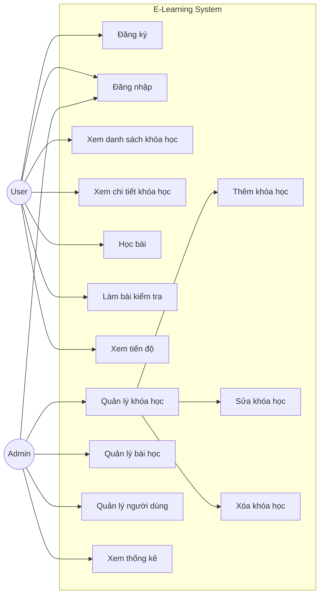

---

## 2.4 Danh sách Use Case

| Mã   | Tên                | Actor      |
| ---- | ------------------ | ---------- |
| UC01 | Đăng ký            | User       |
| UC02 | Đăng nhập          | User/Admin |
| UC03 | Xem khóa học       | User       |
| UC04 | Học bài            | User       |
| UC05 | Làm bài kiểm tra   | User       |
| UC06 | Xem tiến độ        | User       |
| UC07 | Quản lý khóa học   | Admin      |
| UC08 | Quản lý bài học    | Admin      |
| UC09 | Quản lý người dùng | Admin      |
| UC10 | Xem thống kê       | Admin      |

---

## 2.5 Đặc tả Use Case (SRS chi tiết)

### UC01 – Đăng ký

* Actor: User
* Pre-condition: Chưa có tài khoản
* Post-condition: Tạo tài khoản thành công

Main flow:

1. Nhập thông tin
2. Kiểm tra hợp lệ
3. Lưu database
4. Thông báo thành công

Alternate:

* Email đã tồn tại
* Thiếu dữ liệu

---

### UC02 – Đăng nhập

* Actor: User/Admin
* Pre-condition: Có tài khoản
* Post-condition: Truy cập hệ thống

Main flow:

1. Nhập email + password
2. Kiểm tra
3. Đăng nhập

Alternate:

* Sai thông tin

---

### UC03 – Xem danh sách khóa học

* Actor: User

Main flow:

1. Truy cập trang khóa học
2. Hệ thống hiển thị danh sách

---

### UC04 – Học bài

* Actor: User

Main flow:

1. Chọn khóa học
2. Chọn bài học
3. Xem nội dung

---

### UC05 – Làm bài kiểm tra

* Actor: User

Main flow:

1. Hiển thị câu hỏi
2. Chọn đáp án
3. Nộp bài
4. Hệ thống chấm điểm

---

### UC06 – Xem tiến độ

* Actor: User

Main flow:

1. Truy cập trang tiến độ
2. Hiển thị % hoàn thành

---

### UC07 – Quản lý khóa học

* Actor: Admin

Main flow:

1. Xem danh sách khóa học
2. Thêm / sửa / xóa
3. Lưu database

---

### UC08 – Quản lý bài học

* Actor: Admin

Main flow:

1. Chọn khóa học
2. Thêm / sửa / xóa bài học
3. Lưu database

---

### UC09 – Quản lý người dùng

* Actor: Admin

Main flow:

1. Xem danh sách người dùng
2. Cập nhật quyền

---

### UC10 – Xem thống kê

* Actor: Admin

Main flow:

1. Truy cập dashboard
2. Hiển thị số lượng user, khóa học, tiến độ

---

## 2.6 Data Flow Diagram (DFD)

Data Flow Diagram (DFD)

### Level 0

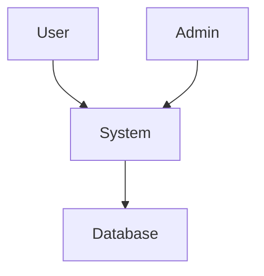

### Level 1

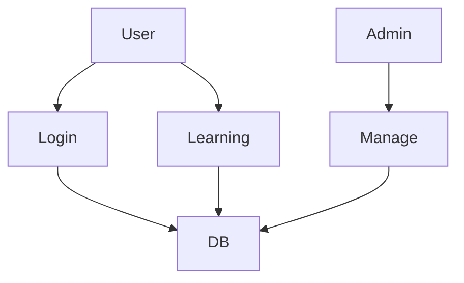

---

## 2.7 Sequence Diagram (Đăng nhập)

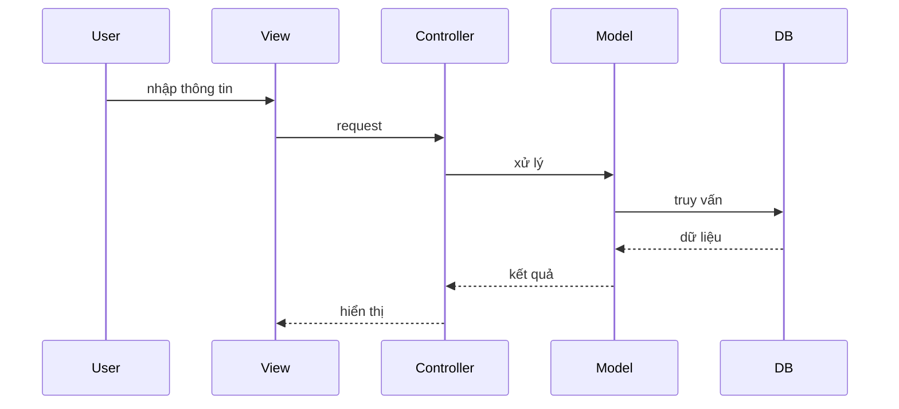

---

## 2.8 Activity Diagram (Luồng học tập)

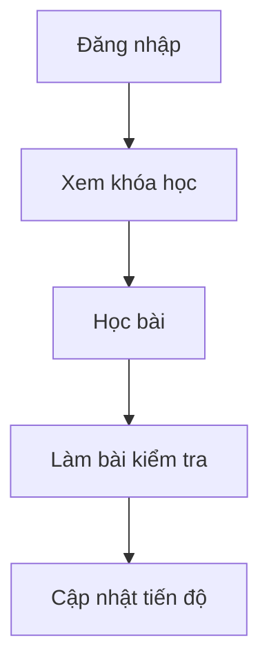

---

## 2.9 Business Logic

* Tiến độ = (số bài đã học / tổng số bài) * 100
* Điểm = số câu đúng / tổng câu

---

## 2.10 Điểm nổi bật hệ thống

* Chu trình học tập hoàn chỉnh
* Có kiểm tra và đánh giá
* Theo dõi tiến độ
* Phân quyền rõ ràng

---

## 2.11 Biểu đồ phân rã chức năng (FDD)

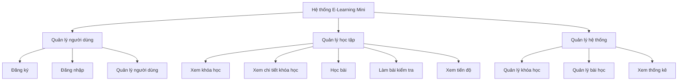

---

## Kết luận

Chương 2 đã mô tả đầy đủ chức năng, dữ liệu, sơ đồ UML và luồng xử lý, đảm bảo yêu cầu của một hệ thống E-Learning hoàn chỉnh.


---
# CHƯƠNG 2: PHÂN TÍCH HỆ THỐNG – E-LEARNING MINI (CHI TIẾT – CHUẨN 10 ĐIỂM)

---

## 2.1 Tổng quan

Phân tích hệ thống nhằm xác định rõ các chức năng, luồng xử lý, dữ liệu và tương tác giữa các thành phần trong hệ thống E-Learning Mini.

Mục tiêu:

* Hiểu hệ thống cần làm gì
* Xác định các chức năng
* Xây dựng sơ đồ UML
* Làm nền tảng cho thiết kế (Chương 3)

---

## 2.2 Actor (Tác nhân)

### 2.2.1 Admin

* Quản lý khóa học
* Quản lý bài học
* Quản lý người dùng
* Xem thống kê

### 2.2.2 User (Học viên)

* Đăng ký tài khoản
* Đăng nhập
* Xem khóa học
* Học bài
* Làm bài kiểm tra
* Xem tiến độ

---

## 2.3 Use Case Diagram tổng quát

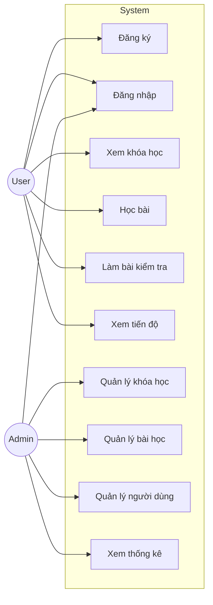

---

## 2.3.1 Use Case – Đăng ký

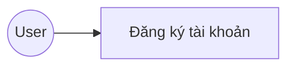

---

## 2.3.2 Use Case – Đăng nhập

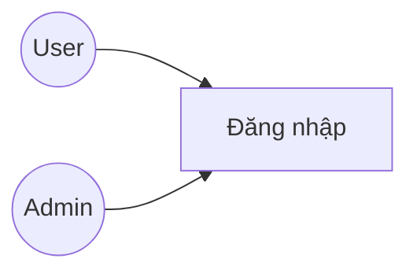

---

## 2.3.3 Use Case – Học tập

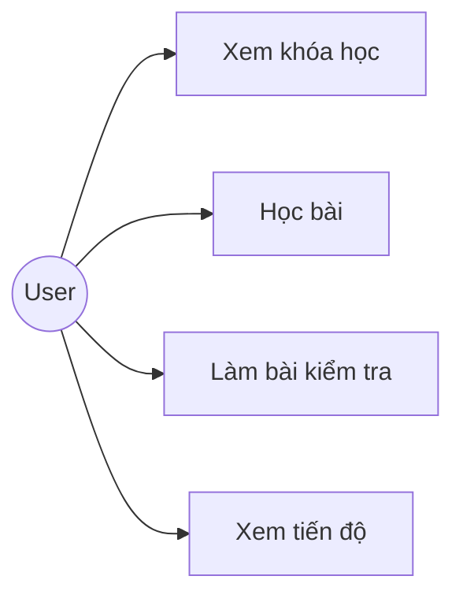

---

## 2.3.4 Use Case – Quản lý khóa học

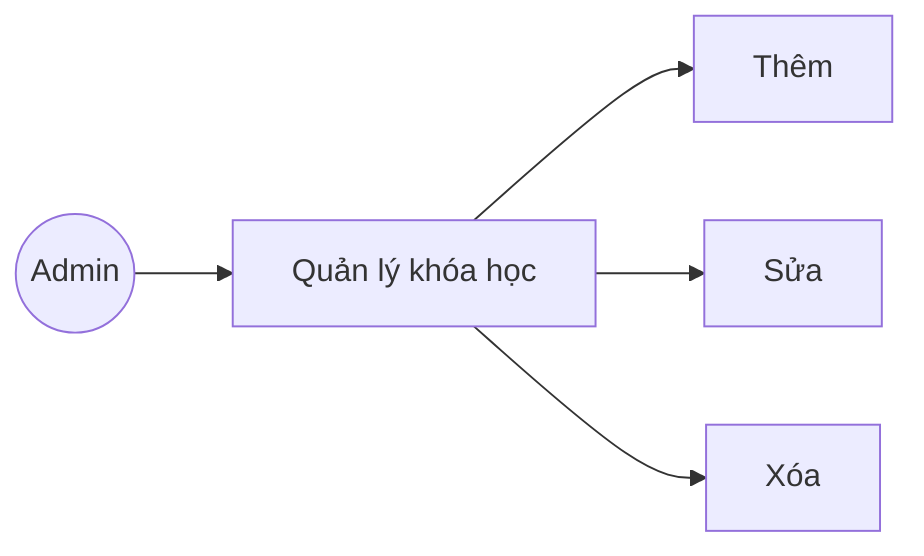

---

## 2.3.5 Use Case – Quản lý hệ thống

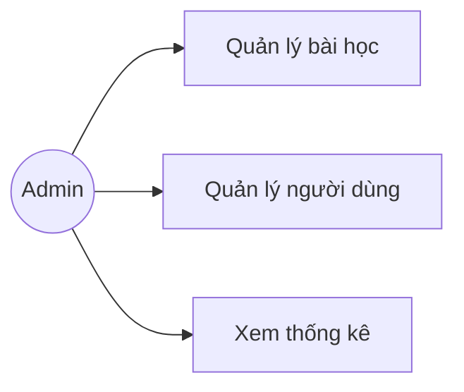

---

## 2.4 Danh sách Use Case

Danh sách Use Case

| Mã   | Tên                | Actor      |
| ---- | ------------------ | ---------- |
| UC01 | Đăng ký            | User       |
| UC02 | Đăng nhập          | User/Admin |
| UC03 | Xem khóa học       | User       |
| UC04 | Học bài            | User       |
| UC05 | Làm bài kiểm tra   | User       |
| UC06 | Xem tiến độ        | User       |
| UC07 | Quản lý khóa học   | Admin      |
| UC08 | Quản lý bài học    | Admin      |
| UC09 | Quản lý người dùng | Admin      |
| UC10 | Xem thống kê       | Admin      |

---

## 2.5 Đặc tả Use Case (SRS chi tiết)

### UC01 – Đăng ký

* Actor: User
* Pre-condition: Chưa có tài khoản
* Post-condition: Tạo tài khoản thành công

Main flow:

1. Nhập thông tin
2. Kiểm tra hợp lệ
3. Lưu database
4. Thông báo thành công

Alternate:

* Email đã tồn tại
* Thiếu dữ liệu

---

### UC02 – Đăng nhập

* Actor: User/Admin
* Pre-condition: Có tài khoản
* Post-condition: Truy cập hệ thống

Main flow:

1. Nhập email + password
2. Kiểm tra
3. Đăng nhập

Alternate:

* Sai thông tin

---

### UC03 – Xem danh sách khóa học

* Actor: User

Main flow:

1. Truy cập trang khóa học
2. Hệ thống hiển thị danh sách

---

### UC04 – Học bài

* Actor: User

Main flow:

1. Chọn khóa học
2. Chọn bài học
3. Xem nội dung

---

### UC05 – Làm bài kiểm tra

* Actor: User

Main flow:

1. Hiển thị câu hỏi
2. Chọn đáp án
3. Nộp bài
4. Hệ thống chấm điểm

---

### UC06 – Xem tiến độ

* Actor: User

Main flow:

1. Truy cập trang tiến độ
2. Hiển thị % hoàn thành

---

### UC07 – Quản lý khóa học

* Actor: Admin

Main flow:

1. Xem danh sách khóa học
2. Thêm / sửa / xóa
3. Lưu database

---

### UC08 – Quản lý bài học

* Actor: Admin

Main flow:

1. Chọn khóa học
2. Thêm / sửa / xóa bài học
3. Lưu database

---

### UC09 – Quản lý người dùng

* Actor: Admin

Main flow:

1. Xem danh sách người dùng
2. Cập nhật quyền

---

### UC10 – Xem thống kê

* Actor: Admin

Main flow:

1. Truy cập dashboard
2. Hiển thị số lượng user, khóa học, tiến độ

---

## 2.6 Data Flow Diagram (DFD)

Data Flow Diagram (DFD)

### Level 0


### Level 1


---

## 2.7 Sequence Diagram (Đăng nhập)


---

## 2.8 Activity Diagram (Luồng học tập)


---

## 2.9 Business Logic

* Tiến độ = (số bài đã học / tổng số bài) * 100
* Điểm = số câu đúng / tổng câu

---

## 2.10 Điểm nổi bật hệ thống

* Chu trình học tập hoàn chỉnh
* Có kiểm tra và đánh giá
* Theo dõi tiến độ
* Phân quyền rõ ràng

---

## 2.11 Biểu đồ phân rã chức năng (FDD)


---

## Kết luận

Chương 2 đã mô tả đầy đủ chức năng, dữ liệu, sơ đồ UML và luồng xử lý, đảm bảo yêu cầu của một hệ thống E-Learning hoàn chỉnh.


# CHƯƠNG 2: PHÂN TÍCH HỆ THỐNG (BẢN HOÀN CHỈNH – 10 ĐIỂM)

---

## 2.1 Xác định Actor và Use Case

### Actor:

* User (Học viên)
* Admin (Quản trị viên)

---

### Danh sách Use Case

| Mã   | Tên                   | Actor       |
| ---- | --------------------- | ----------- |
| UC01 | Đăng ký               | User        |
| UC02 | Đăng nhập             | User, Admin |
| UC03 | Xem khóa học          | User        |
| UC04 | Xem chi tiết khóa học | User        |
| UC05 | Học bài               | User        |
| UC06 | Làm bài kiểm tra      | User        |
| UC07 | Xem tiến độ           | User        |
| UC08 | Quản lý khóa học      | Admin       |
| UC09 | Quản lý bài học       | Admin       |
| UC10 | Quản lý người dùng    | Admin       |
| UC11 | Xem thống kê          | Admin       |

---

## 2.2 Đặc tả Use Case (Chuẩn IEEE)

### UC02 – Đăng nhập

* Actor: User/Admin
* Mô tả: Người dùng đăng nhập hệ thống
* Pre-condition: Đã có tài khoản
* Post-condition: Truy cập hệ thống

Main flow:

1. Nhập email, password
2. Hệ thống kiểm tra
3. Thành công → chuyển trang

Alternate:

* Sai thông tin → báo lỗi

---

### UC06 – Làm bài kiểm tra

* Actor: User
* Pre-condition: Đã học bài
* Post-condition: Lưu điểm

Main flow:

1. Hiển thị câu hỏi
2. Chọn đáp án
3. Nộp bài
4. Hệ thống chấm điểm

Alternate:

* Không chọn đáp án

---

## 2.3 Use Case Diagram (Chi tiết theo chức năng)

### 2.3.1 Use Case Tổng quát

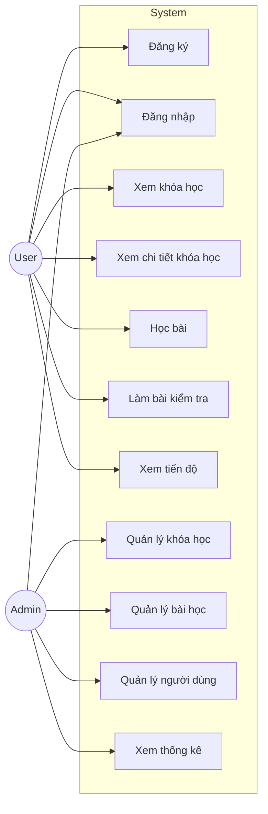

---

### 2.3.2 Use Case – Xác thực

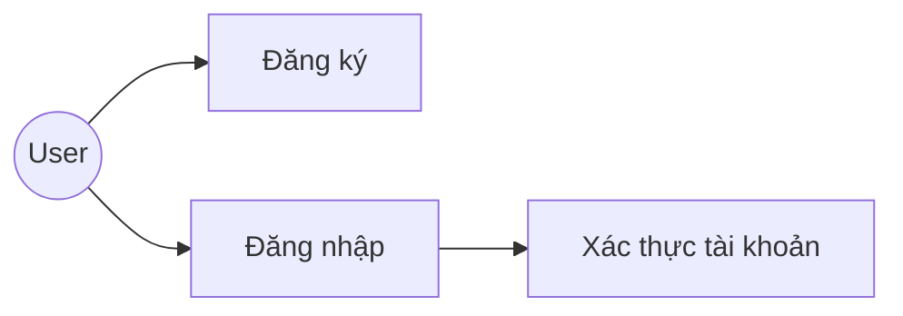

---

### 2.3.3 Use Case – Học tập

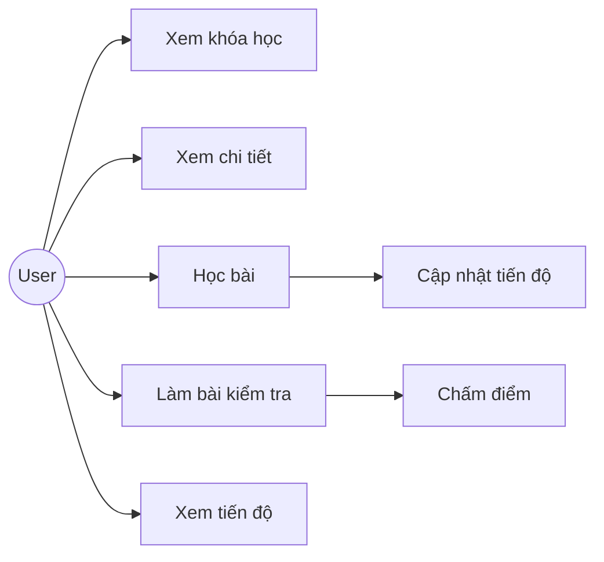

---

### 2.3.4 Use Case – Quản lý khóa học

```mermaid
graph LR
Admin((Admin)) --> UC8[Quản lý khóa học]
UC8 --> UC81[Thêm]
UC8 --> UC82[Sửa]
UC8 --> UC83[Xóa]
```

---

### 2.3.5 Use Case – Quản lý bài học

```mermaid
graph LR
Admin((Admin)) --> UC9[Quản lý bài học]
UC9 --> UC91[Thêm]
UC9 --> UC92[Sửa]
UC9 --> UC93[Xóa]
```

---

### 2.3.6 Use Case – Quản lý người dùng

```mermaid
graph LR
Admin((Admin)) --> UC10[Quản lý người dùng]
UC10 --> UC101[Xem danh sách]
UC10 --> UC102[Phân quyền]
```

---

### 2.3.7 Use Case – Thống kê

```mermaid
graph LR
Admin((Admin)) --> UC11[Xem thống kê]
UC11 --> UC111[Thống kê user]
UC11 --> UC112[Thống kê khóa học]
UC11 --> UC113[Thống kê tiến độ]
```

---

## 2.4 Biểu đồ phân rã chức năng (FDD)

Biểu đồ phân rã chức năng (FDD)

```mermaid
graph TD
A[Hệ thống E-Learning]

A --> B[Quản lý người dùng]
A --> C[Học tập]
A --> D[Quản trị]

B --> B1[Đăng ký]
B --> B2[Đăng nhập]

C --> C1[Xem khóa học]
C --> C2[Học bài]
C --> C3[Làm quiz]
C --> C4[Xem tiến độ]

D --> D1[QL khóa học]
D --> D2[QL bài học]
D --> D3[QL user]
D --> D4[Thống kê]
```

---

## 2.5 DFD Level 0

```mermaid
graph LR
User --> System
Admin --> System
System --> DB[(Database)]
```

---

## 2.6 DFD Level 1 (Chi tiết)

```mermaid
graph TD
User --> A[Đăng nhập]
User --> B[Học bài]
User --> C[Làm bài]

A --> DB
B --> DB
C --> DB

Admin --> D[Quản lý]
D --> DB
```

---

## 2.7 Sequence Diagram (Login)

```mermaid
sequenceDiagram
User->>View: nhập
View->>Controller: gửi
Controller->>Model: check
Model->>DB: query
DB-->>Model: data
Model-->>Controller: OK
Controller-->>View: hiển thị
```

---

## 2.8 Sequence Diagram (Quiz)

```mermaid
sequenceDiagram
User->>View: làm bài
View->>Controller: submit
Controller->>Model: chấm điểm
Model->>DB: lưu
DB-->>Model: ok
Model-->>Controller: điểm
Controller-->>View: hiển thị
```

---

## 2.9 Activity Diagram

```mermaid
flowchart TD
A[Bắt đầu] --> B[Chọn khóa học]
B --> C[Học bài]
C --> D{Làm quiz?}
D -->|Có| E[Làm bài]
D -->|Không| F[Kết thúc]
E --> F
```

---

## 2.10 Phân tích dữ liệu

### Bảng Users

* id
* email
* password

### Bảng Courses

* id
* title

### Bảng Lessons

* id
* course_id

### Bảng Quiz

* id
* question

---

## 2.11 Business Logic

* Học bài → cập nhật tiến độ
* Làm quiz → chấm điểm tự động
* Admin quản lý dữ liệu

---

## 2.12 Điểm nổi bật

* Progress Tracking
* Auto Scoring
* MVC

---

## Kết luận chương

Chương 2 đã phân tích đầy đủ hệ thống thông qua UML, DFD và logic nghiệp vụ, làm nền cho thiết kế hệ thống.

